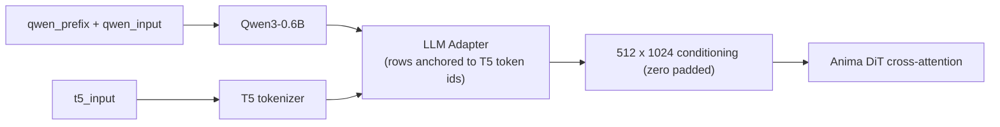

# ComfyUI Anima Decoupled Conditioning

This node separates Anima's two text towers — the **Qwen3-0.6B source encoder** and the
**T5 target tokenizer** — into two independent inputs, so each can receive its own text:
narrative and structure on the Qwen side, drawable content on the T5 side. This raises
the amount of prompt information the model can act on.

[中文说明](README.zh-CN.md) · [Usage guide](docs/usage.md) · [Mechanism notes](docs/mechanism.md)

## The node

The node replaces the positive text-encoding node of an existing workflow. Take the CLIP
output of the Anima checkpoint and connect it to the `clip` input; connect the
`conditioning` output to the sampler's positive conditioning input. The negative
conditioning path is left unchanged.

| Direction | Name | Type | Default | Description |
|---|---|---|---|---|
| input | `clip` | CLIP | — | Text encoder of an Anima checkpoint; supplies the Qwen and T5 tokenizers. |
| input | `qwen_input` | STRING | `""` | Body of the text sent to the Qwen3-0.6B encoder. |
| input | `t5_input` | STRING | `""` | Text sent to the T5 tokenizer. **Determines the conditioning row count and each row's token anchor.** |
| input | `qwen_prefix` | STRING | `""` | Joined to the front of `qwen_input` with a single space; enters the Qwen side only. |
| input | `strip_prefix` | BOOLEAN | `true` | Whether to cut the rows occupied by the prefix from the source hidden states. |
| output | `conditioning` | CONDITIONING | — | Positive conditioning for the sampler. The adapter forward pass and padding to 512 rows are performed by upstream `Anima.extra_conds`. |

Data flow:



## Use cases

### 1. Prompt repetition — `PP【P】`

Notation: `P` is the prompt; `PP【P】` means the prompt is encoded three times and only the
third copy is kept as conditioning rows.

The form can be added to an existing workflow without changing any other connection or
parameter: supply the repeated prompt in `qwen_prefix`.

```
qwen_prefix  = P P      # two copies, cut after encoding
qwen_input   = P        # the copy that is kept
t5_input     = <original prompt>
strip_prefix = true
```

The node joins the three copies into `P P P`, encodes the result once, and cuts the rows
occupied by the first two copies by token-level longest common prefix. Qwen uses causal
attention, so every token of the third copy can attend to the first two (measured
backflow 0.118; the first copy measures exactly 0 as the causal control). The retained
copy therefore carries an approximately bidirectional encoding of the prompt — at
0.6B scale this compensates for the model's limited context window per token.
**The conditioning row count is identical to the single-pass form, and the T5 side is
unaffected.**

The gain decays quickly with repetition count: the third copy reaches about 86–92% of the
sixth copy's effect, and the second copy already exceeds half. Three copies is the
recommended starting point.

Writing the three copies directly into `qwen_input` is an alternative form with the same
intent, but the first copy then remains in the adapter's key set without having been
contextualized. The measured displacement for that form is about one third of the form
above, and it mixes in a nearly orthogonal key-duplication effect; it is therefore not
the recommended form. See [mechanism notes](docs/mechanism.md).

Measured caveats:

- **Style shift.** A change on the source side changes the overall direction of the
  conditioning, so artist and style mixing can differ from the result without the node.
  Compare at a fixed seed before switching.
- **Pure-tag prompts are insensitive.** When `t5_input` is a pure tag string, the Qwen
  channel contributes little to the final conditioning (measured at roughly the 9% level
  for a pure-tag target), so the source-side change may not reach the image. The form is
  more applicable when the source is natural-language description.

### 2. Standard tags on T5, natural-language scene description on Qwen

The conditioning row count is determined by the T5 tokenization, and row content is what
the DiT reads. Placing structure, relationships and narrative on the Qwen side carries
context capacity on a channel that consumes no conditioning rows.

Reproducible example (`qwen_prefix` empty, `strip_prefix` left enabled; only the other two
fields are set):

```
qwen_input = A courier leans on a rusted railing above a flooded street; neon signs
             behind her reflect in the puddles. Rain streaks across the lens and the
             background falls out of focus behind her left shoulder.
t5_input   = 1girl, solo, courier jacket, rain, puddle, neon sign, railing, night,
             from side, shallow depth of field, (backlight:1.2)
```

- Content to be drawn belongs in `t5_input`, expressed as complete phrases: the DiT's
  cross-attention applies no mask and no RoPE, so conditioning rows are an unordered set
  and binding is carried only by row content.
- Prose, structure markers and comments belong on the Qwen side. In measurement, meta-text
  placed on the target side (a literal such as `@handle`) was rendered as visible text in
  the image.
- This channel has less leverage than the T5 side. It is applicable to disambiguation and
  steering, not to overriding the content of `t5_input`.

## How it works

### Why the split is possible

Upstream `AnimaTokenizer` tokenizes one text twice — once with the Qwen vocabulary and
once with the T5 vocabulary — and sends both results into the same conditioning path.
Nothing in the code requires the two sides to originate from the same text:

- `LLMAdapter(source_hidden_states, target_input_ids)` takes two independent inputs; the
  row count is determined entirely by the target (T5) side;
- the adapter aligns the Qwen hidden states into the T5 conditioning space. It is
  separate from the DiT and is completed before DiT training; the DiT consumes only the
  adapter's output and does not distinguish where either side came from, so replacing the
  source text requires no DiT change;
- the node therefore produces two items only: source hidden states written to
  `cross_attn`, and the target side written to `t5xxl_ids` and `t5xxl_weights`. The
  adapter forward pass and padding to 512 rows are performed by upstream
  `Anima.extra_conds`.

### Why repetition is effective

Qwen3-0.6B is small and uses causal attention: in a single pass over `A B C`, `A` cannot
attend to `B` or `C`. Encoded as `A1 B1 C1 A2 B2 C2`, every token of the second copy can
attend to the first copy, so later content flows back into earlier positions. Measured:
changing only the final tag from `flower` to `sword` displaces the shared-prefix hidden
states of the second copy by 0.118, and the two different edits produce directions with a
cosine of 0.27 — the backflow carries specific content, not a generic drift. Keeping only
the final copy as conditioning rows yields an approximately bidirectional encoding at an
unchanged row count.

### `strip_prefix` processing

1. Join as `source_text = qwen_prefix.strip() + " " + qwen_input.lstrip()`; when the
   prefix is empty, `qwen_input` is used directly.
2. Tokenize `source_text` and the prefix separately with the Qwen tokenizer.
3. The number of rows cut is the measured length of the longest common prefix of the two
   token-id sequences, not `len(tokenize(prefix))`: whitespace merging at the join point
   changes the token count by one.
4. Those leading rows are cut (`cond[:, dropped:]`) before the adapter runs. The prefix
   still influences later rows through attention, but occupies no conditioning row.

If the prefix shares no token prefix with the joined text, the node raises an error rather
than silently retaining the prefix rows.

## Installation

### Option 1 — git (recommended)

```bash
cd ComfyUI/custom_nodes
git clone https://github.com/XiaoLinXiaoZhu/comfyui-anima-decoupled.git
```

Restart ComfyUI afterwards.

### Option 2 — ComfyUI Manager

In ComfyUI Manager, choose **Install via Git URL** and paste:

```
https://github.com/XiaoLinXiaoZhu/comfyui-anima-decoupled.git
```

No dependencies beyond the `torch` shipped with ComfyUI.

## Compatibility

- Built for Anima (Cosmos-Predict2 style DiT + Qwen3-0.6B source + T5 target).
- Requires a ComfyUI build with Anima support: upstream `>= 0.11.0`, the first release
  containing `comfy/text_encoders/anima.py`. Developed against `0.37.0`.
- The node class key remains `AnimaDecoupledConditioning`.

## Development

```bash
python tests/test_anima_decoupled.py
```

The tests use a CLIP stand-in and require neither a model nor a GPU.

## License

[MIT](LICENSE)
