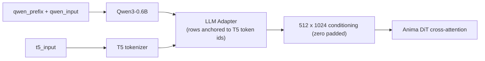

# ComfyUI Anima Decoupled Conditioning

This extension provides the `Anima Decoupled Conditioning` node. It splits Anima's
two text towers — the **Qwen3-0.6B source encoder** and the **T5 target tokenizer** —
so each can receive its own text, which lets the model make better use of your prompt.

[中文说明](README.zh-CN.md) · [Usage guide](docs/usage.md) · [Mechanism notes](docs/mechanism.md)

## The node

Use it exactly like a positive `CLIPTextEncode`: connect the Anima checkpoint's CLIP
output to `clip`, connect `conditioning` to the sampler's positive input, and leave the
negative path as it is.

| | Name | Type | Default | Description |
|---|---|---|---|---|
| in | `clip` | CLIP | — | CLIP output of an Anima checkpoint (required; it provides the Qwen + T5 tokenizers). |
| in | `qwen_input` | STRING | `""` | Body of the text handed to Qwen3-0.6B. |
| in | `t5_input` | STRING | `""` | Text handed to T5; **decides the conditioning row count and each row's token anchor**. |
| in | `qwen_prefix` | STRING | `""` | Prepended to `qwen_input` on the Qwen side only, with exactly one space. |
| in | `strip_prefix` | BOOLEAN | `true` | Whether to cut the prefix's own rows from the source hidden states. |
| out | `conditioning` | CONDITIONING | — | Upstream `Anima.extra_conds` runs the adapter and zero-pads to 512 rows. |



## Use cases

### 1. Repeat the prompt — `PP【P】`

Start here. It takes almost no change to an existing workflow: copy your prompt twice
into `qwen_prefix` and leave every connection and parameter as it was.

Notation: `P` is your prompt; `PP【P】` means "encode `P` three times, keep only the
third copy as conditioning rows".

```
qwen_prefix  = P P      <- two copies, stripped away
qwen_input   = P        <- the copy that survives
t5_input     = <your usual prompt>
strip_prefix = true
```

The node joins them into `P P P`, encodes that once, and cuts the first two copies'
rows by token-level longest common prefix. Qwen attention is causal, so the surviving
third copy has seen the first two (measured backflow 0.118; the first copy is exactly
0), which gives the small model a roughly bidirectional view — while the **conditioning
row count stays identical to a single pass** and the T5 side is untouched.

Gains fall off quickly: the third copy already reaches ~86–92% of the sixth copy's
effect, and the second copy gets more than half. Three copies is the recommended start.

Do not put the three copies directly into `qwen_input`: the un-contextualized first copy
then stays among the adapter's keys, and the measured shift is only about a third of
this recipe's, mixed with a nearly orthogonal key-duplication effect. See
[mechanism notes](docs/mechanism.md).

> **Two measured caveats**
>
> - **It changes the art style.** A different source shifts the overall direction of the
>   conditioning, so artist/style mixing can differ from what you get without it. Compare
>   at a fixed seed before switching.
> - **Natural language shows more than pure tags.** When `t5_input` is a pure tag string,
>   the Qwen channel has little leverage on the final conditioning (measured at roughly
>   the 9% level for a pure-tag target), so the repeated source may barely show. It is
>   worth trying when the source is natural-language description.

### 2. Standard tags on T5, natural-language scene description on Qwen

The row count comes from the T5 tokenization, and row content is what the DiT actually
reads. Putting structure, relationships and narrative on the Qwen side attaches nearly
unlimited context capacity through a channel that **costs no conditioning rows**.

A reproducible example (`qwen_prefix` empty, `strip_prefix` left on; only the other two
fields change):

```
qwen_input = A courier leans on a rusted railing above a flooded street; neon signs
             behind her reflect in the puddles. Rain streaks across the lens and the
             background falls out of focus behind her left shoulder.
t5_input   = 1girl, solo, courier jacket, rain, puddle, neon sign, railing, night,
             from side, shallow depth of field, (backlight:1.2)
```

- Write what you want drawn into `t5_input`, as complete phrases: the DiT's
  cross-attention has no mask and no RoPE, so conditioning rows are an unordered set and
  binding can only ride on the row content itself.
- Put prose, structure markers and comments on the Qwen side. In testing, meta-text
  (for example a literal `@handle`) placed in the target side was rendered as visible
  text in the image.
- This channel has less leverage than the T5 side: it is good for disambiguation and
  steering, not for overriding what `t5_input` says.

## How it works

### Why the split is possible

Upstream `AnimaTokenizer` just tokenizes **one** text twice (Qwen vocabulary and T5
vocabulary) and sends both into the same conditioning path; nothing in the code requires
the two to come from the same text:

- `LLMAdapter(source_hidden_states, target_input_ids)` takes two independent inputs, and
  the row count is decided entirely by the target (T5) side;
- the adapter aligns the Qwen hidden states into the T5 conditioning space. It is a
  separate component, completed before DiT training, and the DiT only consumes the
  adapter's output without caring where either side came from — so changing the source
  text needs no DiT change;
- the node therefore only produces two things: source hidden states in `cross_attn`, and
  the target side's `t5xxl_ids` / `t5xxl_weights`. Upstream `Anima.extra_conds` runs the
  adapter and zero-pads to 512 rows.

### Why repetition helps

Qwen3-0.6B is a small causal model: in a single pass over `A B C`, `A` cannot see `B` or
`C`. Encoded as `A1 B1 C1 A2 B2 C2`, every token of the second copy can attend to the
first copy — later content flows back into earlier positions. Measured: changing only the
last tag from `flower` to `sword` moves the shared-prefix hidden states of the second
copy by 0.118, while the two different edits produce directions with cosine 0.27 — the
backflow carries specific content, not a generic "some preceding text exists" drift.
Keeping only the last copy as conditioning rows yields a roughly bidirectional view at
an unchanged row count.

### What `strip_prefix` does

1. `source_text = qwen_prefix.strip() + " " + qwen_input.lstrip()` (the body alone when
   the prefix is empty).
2. `source_text` and the prefix are tokenized separately with the Qwen tokenizer.
3. The dropped row count is the **measured** longest common prefix of the two token-id
   sequences — not `len(tokenize(prefix))`, because whitespace merging at the join point
   can shift the count by one.
4. Those leading rows are sliced off (`cond[:, dropped:]`) before the adapter runs: the
   prefix still influences later rows through attention without occupying a row itself.

If the prefix shares no token prefix with the joined text, the node raises instead of
silently keeping prefix rows.

## Installation

### Option 1 — git (recommended)

```bash
cd ComfyUI/custom_nodes
git clone https://github.com/XiaoLinXiaoZhu/comfyui-anima-decoupled.git
```

Then restart ComfyUI.

### Option 2 — ComfyUI Manager

Choose **Install via Git URL** and paste:

```
https://github.com/XiaoLinXiaoZhu/comfyui-anima-decoupled.git
```

No Python dependencies beyond what ComfyUI already ships (`torch`).

## Compatibility

- Built for Anima (Cosmos-Predict2 style DiT + Qwen3-0.6B source + T5 target).
- Requires a ComfyUI build with Anima support: upstream `>= 0.11.0` (the release that
  shipped `comfy/text_encoders/anima.py`). Developed against `0.37.0`.
- The node class key stays `AnimaDecoupledConditioning`.

## Development

```bash
python tests/test_anima_decoupled.py
```

The tests use a CLIP stand-in, so they run without a model or a GPU.

## License

[MIT](LICENSE)
