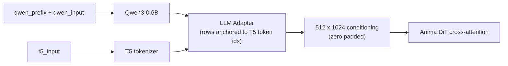

# ComfyUI Anima Decoupled Conditioning

A single-node ComfyUI extension that feeds **two different texts** to the two text
towers that Anima actually uses: the **Qwen3-0.6B source encoder** and the **T5
target tokenizer**.

[中文说明](README.zh-CN.md) · [Usage guide](docs/usage.md) · [Mechanism notes](docs/mechanism.md)

---

## What it does

Upstream Anima tokenizes **one** text twice and hands both results to the same
conditioning path. This node breaks that link:

| Input | Goes to | Effect |
|---|---|---|
| `qwen_input` | Qwen3-0.6B source encoder | contextualizes the conditioning |
| `t5_input` | T5 target side | **decides how many conditioning rows exist and what each row is anchored to** |
| `qwen_prefix` | prepended to `qwen_input` on the Qwen side only | shapes the source hidden states |
| `strip_prefix` | — | when on (default), removes the prefix's own rows so it never becomes a conditioning row |

It is pure mechanism: no XML parsing, no tag cleanup, no format validation. You
decide what each side receives.



## Installation

### Option 1 — git (recommended)

```bash
cd ComfyUI/custom_nodes
git clone https://github.com/XiaoLinXiaoZhu/comfyui-anima-decoupled.git
```

Then restart ComfyUI.

### Option 2 — ComfyUI Manager

In ComfyUI Manager choose **Install via Git URL** and paste:

```
https://github.com/XiaoLinXiaoZhu/comfyui-anima-decoupled.git
```

No Python dependencies beyond what ComfyUI already ships (`torch`).

## Quick start

1. Add the **Anima Decoupled Conditioning** node (category `conditioning`).
2. Connect your Anima checkpoint's `CLIP` output to `clip`.
3. Wire the node's `conditioning` output into the positive input of your sampler,
   exactly where a `CLIPTextEncode` used to be.
4. Fill `qwen_input`, `t5_input` and (optionally) `qwen_prefix`.

A common first setup — a structured description for Qwen, a clean tag string for
T5:

```
qwen_input = A girl stands on a rooftop at sunset, her coat open in the wind.
             Warm rim light, telephoto compression, shallow depth of field.
t5_input   = 1girl, solo, rooftop, sunset, coat, wind, rim light, telephoto
qwen_prefix = (empty)
strip_prefix = true
```

## Node reference

| Input | Type | Required | Default | Description |
|---|---|---|---|---|
| `clip` | CLIP | yes | — | CLIP output of an Anima checkpoint (it must use Anima's dual tokenizer). |
| `qwen_input` | STRING (multiline) | yes | `""` | Body of the text encoded by Qwen3-0.6B. |
| `t5_input` | STRING (multiline) | yes | `""` | Text tokenized by T5. It sets the number of conditioning rows and their token anchors. |
| `qwen_prefix` | STRING (multiline) | no | `""` | Prepended to `qwen_input` with exactly one space, on the Qwen side only. |
| `strip_prefix` | BOOLEAN | no | `true` | Remove the rows that belong to `qwen_prefix` from the source hidden states. |

| Output | Type | Description |
|---|---|---|
| `conditioning` | CONDITIONING | Source hidden states in `cross_attn`, plus `t5xxl_ids` / `t5xxl_weights` in the entry's extra dict. Upstream `Anima.extra_conds` runs the adapter and zero-pads to 512 rows. |

## Use cases

### 1. Decoupled source and target

Give Qwen a full natural-language description and give T5 a clean tag string, or
the other way around. The two sides are independent: the number of conditioning
rows is decided by `t5_input` alone, so Qwen text never inflates the row count.

### 2. Repeat the prompt — `PP【P】`

Notation used below: `P` is your prompt, and `PP【P】` means "encode `P` three
times and keep only the third copy as conditioning rows":

```
qwen_prefix  = P P      <- two copies, stripped away
qwen_input   = P        <- the copy that survives
t5_input     = <your usual tag string>
strip_prefix = true
```

The node joins them into `P P P`, encodes that once, and cuts the first two
copies' rows by token-level longest common prefix. The retained copy has
attended to both earlier copies through Qwen's causal attention, so it carries a
near-bidirectional view of the text — while the conditioning row count stays
exactly the same as a single pass.

Why not simply put `P P P` in `qwen_input`? Because then all three copies stay
visible to the adapter, including the first one that never saw the rest of the
text. Measured on a single Anima checkpoint at the conditioning-vector level,
keeping only the last copy moves the conditioning **2.8–3.8×** further than
leaving all three copies in, and the direction is cleaner (the "all copies
visible" variant mixes in a nearly orthogonal key-duplication effect). See
[Mechanism notes](docs/mechanism.md) for the numbers.

Repeat counts beyond three keep helping, but with sharply diminishing returns:
the third copy already reaches roughly 86–92% of the sixth copy's effect. Two
copies capture more than half.

> These are conditioning-level measurements, not image-quality results. They
> show the mechanism is real and where it saturates; whether your images get
> better is something to A/B on your own prompts.

### 3. A prefix that never becomes a drawable row

With `strip_prefix` on, `qwen_prefix` influences every following source row
through attention but contributes no conditioning row of its own. That is the
right place for house style, aspect hints or boilerplate: text placed directly
in `t5_input` is what the DiT reads, and meta-text there has been observed to
show up as visible text in the picture.

### 4. Control the row budget

The number of live conditioning rows equals the T5 token count of `t5_input`
(upstream zero-pads to 512). Putting structure, comments or metadata on the
Qwen side keeps `t5_input` short and its real-row : zero-row ratio high.

## How `strip_prefix` works

1. `source_text = qwen_prefix.strip() + " " + qwen_input.lstrip()` (unchanged
   when the prefix is empty).
2. `source_text` and `qwen_prefix` are both tokenized with the Qwen tokenizer.
3. The dropped row count is the **measured** longest common prefix of the two
   token-id sequences — not `len(tokenize(prefix))`, because whitespace merging
   at the join point can shift the count by one.
4. Those leading rows are sliced off `cond[:, dropped:]` before the adapter runs.

If the prefix shares no token prefix with the joined text, the node raises an
error instead of silently keeping prefix rows.

## Compatibility

- Built for Anima (Cosmos-Predict2 style DiT + Qwen3-0.6B source + T5 target).
- Requires a ComfyUI build with Anima support: upstream `>= 0.11.0` (the release
  that shipped `comfy/text_encoders/anima.py`). Developed against `0.37.0`.
- The node class key is `AnimaDecoupledConditioning`, so workflows saved against
  earlier releases that used the same class name keep resolving.

## Development

```bash
python tests/test_anima_decoupled.py
```

The tests use a CLIP stand-in, so they run without a model or a GPU.

## License

[MIT](LICENSE)
