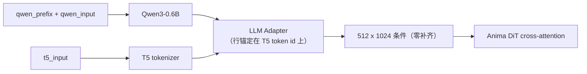

# ComfyUI Anima Decoupled Conditioning（Anima 解耦条件）

本节点将 Anima 的两个文本塔——**Qwen3-0.6B source 编码器**与 **T5 target 分词器**——拆分为两个
独立输入，使两侧可以分别接收不同的文本：Qwen 侧承载叙述与结构，T5 侧承载需要绘制的内容，从而
提升模型对提示词的理解能力。

[English](README.md) · [使用文档](docs/usage.md) · [机制说明](docs/mechanism.md)

## 节点

本节点替代工作流中原有的正面文本编码节点。从 Anima checkpoint 的文本编码器取出 CLIP 输出，接入
本节点的 `clip` 输入；将本节点的 `conditioning` 输出接入采样器的正面条件输入。负面条件维持原有
接线不变。

| 方向 | 名称 | 类型 | 默认 | 说明 |
|---|---|---|---|---|
| 输入 | `clip` | CLIP | — | 取自 Anima checkpoint 的文本编码器；提供 Qwen 与 T5 双分词器。 |
| 输入 | `qwen_input` | STRING | `""` | 送入 Qwen3-0.6B 编码器的正文。 |
| 输入 | `t5_input` | STRING | `""` | 送入 T5 分词器的文本。**决定条件行数与每行的 token 锚。** |
| 输入 | `qwen_prefix` | STRING | `""` | 以单个空格拼接在 `qwen_input` 之前，仅进入 Qwen 侧。 |
| 输入 | `strip_prefix` | BOOLEAN | `true` | 是否从 source 隐状态中切去前缀所占的行。 |
| 输出 | `conditioning` | CONDITIONING | — | 送入采样器的正面条件。adapter 前向与补齐至 512 行由上游 `Anima.extra_conds` 执行。 |

数据流：



## 经典用例

### 1. 提示词重复 —— `PP【P】`

记法：`P` 为提示词；`PP【P】` 表示将 `P` 编码三遍，仅保留第三遍作为条件行。

该用法可直接接入既有工作流：在 `qwen_prefix` 中提供重复两遍的提示词，`qwen_input` 保留一份，
其余接线与参数不变。

```
qwen_prefix  = P P      # 重复两遍的副本，编码后切去
qwen_input   = P        # 保留下来的副本
t5_input     = <原提示词>
strip_prefix = true
```

节点将三份拼接为 `P P P` 后编码一次，再按 token 级最长公共前缀切去前两遍所占的行。Qwen 采用
因果注意力，第三遍的每个 token 因此可以注意到前两遍的内容（实测后文回流 0.118，第一遍对照严格
为 0），相当于为 0.6B 规模的模型补足一次近似双向的编码。**条件行数与单遍写法一致，T5 侧不受
影响。**

收益随重复次数快速衰减：第三遍达到第六遍效果的约 86–92%，第二遍已超过一半。建议以三遍为起点。

将三份提示词直接写入 `qwen_input` 是等价目的的替代写法，但未经过上下文化的第一遍会保留在
adapter 的 key 集合中。实测该写法的位移仅为上述用法的约三分之一，并混入近乎正交的 key 复制
效应，故不作为推荐写法。详见[机制说明](docs/mechanism.md)。

实测注意事项：

- **画风偏移**：source 侧的改变会改变条件的整体朝向，画师与风格的混合结果可能与未启用时不同。
  换用前应固定随机种子做对照。
- **纯 tag 提示词不敏感**：当 `t5_input` 为纯 tag 串时，Qwen 通道对最终条件的贡献很小（实测该
  通道在纯 tag target 下约占 9% 量级），重复引起的 source 变化可能不足以反映到画面；source 为
  自然语言叙述时更值得采用。

### 2. T5 侧提供标准 tag，Qwen 侧提供自然语言画面描述

条件行数由 T5 分词长度决定，行内容为 DiT 实际读取的对象。将不直接绘制的结构、关系与叙述放入
Qwen 侧，相当于在不占用行预算的通道上承载上下文容量。

可复现示例（`qwen_prefix` 留空，`strip_prefix` 保持开启，仅填写另外两项）：

```
qwen_input = A courier leans on a rusted railing above a flooded street; neon signs
             behind her reflect in the puddles. Rain streaks across the lens and the
             background falls out of focus behind her left shoulder.
t5_input   = 1girl, solo, courier jacket, rain, puddle, neon sign, railing, night,
             from side, shallow depth of field, (backlight:1.2)
```

- 需要绘制的内容写入 `t5_input`，并以完整短语表达归属关系：DiT 的 cross-attention 不施加 mask
  与 RoPE，条件行是无序集合，绑定关系只能由行内容承载。
- 叙述、结构标记与注释放入 Qwen 侧。实测将元文本（例如 `@handle` 这类字面量）置于 target 侧
  时，该文本会被渲染为画面中的可见文字。
- 该通道对最终条件的影响小于 T5 侧，适用于消歧与引导，不适用于覆盖 `t5_input` 的内容。

## 技术介绍

### 为什么可以拆分

上游 `AnimaTokenizer` 对同一段文本分词两次（Qwen 词表与 T5 词表各一次），并将两份结果送入同一条
条件通路。代码层面没有约束两侧必须来自同一段文本：

- `LLMAdapter(source_hidden_states, target_input_ids)` 的两个入口互不依赖，条件行数完全由
  target（T5 token）侧决定；
- adapter 负责将 Qwen 隐状态对齐到 T5 条件空间。它与 DiT 相互独立，在 DiT 训练之前完成，DiT
  只消费 adapter 的输出、不区分两侧来源，因此更换 source 文本不需要修改 DiT；
- 节点因此只需产出两项：source 侧隐状态写入 `cross_attn`，target 侧写入 `t5xxl_ids` 与
  `t5xxl_weights`。adapter 前向与补齐至 512 行由上游 `Anima.extra_conds` 完成。

### 为什么重复有效

Qwen3-0.6B 规模小且采用因果注意力：单遍编码 `A B C` 时，`A` 无法注意到 `B` 与 `C`。编码为
`A1 B1 C1 A2 B2 C2` 后，第二个副本的每个 token 都能注意到第一个副本，后文信息由此回流到更早的
位置。实测：仅将最后一个 tag 由 `flower` 改为 `sword`，第二副本公共前缀 token 的隐状态位移为
0.118；两种改动的 Δ 方向余弦为 0.27，说明回流携带的是具体内容，而非通用漂移。仅保留最后一个
副本作为条件行，即可在不改变行数的前提下取得近似双向的编码。

### `strip_prefix` 的处理流程

1. 按 `source_text = qwen_prefix.strip() + " " + qwen_input.lstrip()` 拼接；前缀为空时直接使用
   `qwen_input`。
2. 分别使用 Qwen 分词器对 `source_text` 与前缀分词。
3. 切去的行数取两条 token id 序列最长公共前缀的实测长度，而非 `len(tokenize(prefix))`：拼接处
   的空白合并会使 token 数相差 1。
4. 在进入 adapter 之前按 `cond[:, dropped:]` 切去这些行。前缀仍通过注意力影响后续行，但不占用
   条件行。

前缀与拼接文本不存在公共 token 前缀时，节点抛出错误，不会静默保留前缀行。

## 安装

### 方式一 —— git（推荐）

```bash
cd ComfyUI/custom_nodes
git clone https://github.com/XiaoLinXiaoZhu/comfyui-anima-decoupled.git
```

随后重启 ComfyUI。

### 方式二 —— ComfyUI Manager

在 ComfyUI Manager 中选择 **Install via Git URL**，粘贴：

```
https://github.com/XiaoLinXiaoZhu/comfyui-anima-decoupled.git
```

除 ComfyUI 自带的 `torch` 外无额外依赖。

## 兼容性

- 面向 Anima（Cosmos-Predict2 风格 DiT + Qwen3-0.6B source + T5 target）。
- 需要带 Anima 支持的上游 ComfyUI：`>= 0.11.0`（首个包含 `comfy/text_encoders/anima.py` 的
  版本）。开发环境为 `0.37.0`。
- 节点类名保持 `AnimaDecoupledConditioning`。

## 开发

```bash
python tests/test_anima_decoupled.py
```

测试使用替身 CLIP，无需模型与 GPU。

## 许可证

[MIT](LICENSE)
