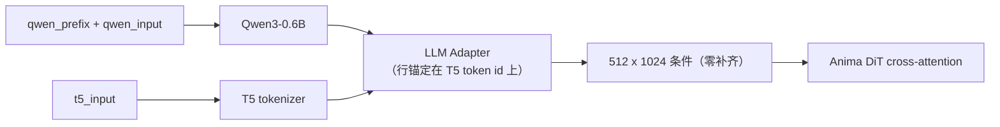

# ComfyUI Anima Decoupled Conditioning（Anima 解耦条件）

本扩展提供 `Anima Decoupled Conditioning` 节点，把 Anima 的两个文本塔拆开——**Qwen3-0.6B source
编码器**与 **T5 target 分词器**——使它们可以分别接收不同的文本，从而提高模型对提示词的理解能力。

[English](README.md) · [使用文档](docs/usage.md) · [机制说明](docs/mechanism.md)

## 节点

直接当作正向的 `CLIPTextEncode` 使用：`clip` 接 Anima checkpoint 的 CLIP 输出，`conditioning`
接采样器的正向输入，负向按原样保留。

| | 名称 | 类型 | 默认 | 说明 |
|---|---|---|---|---|
| 输入 | `clip` | CLIP | — | Anima checkpoint 的 CLIP 输出（必需，它提供 Qwen + T5 双分词器）。 |
| 输入 | `qwen_input` | STRING | `""` | 交给 Qwen3-0.6B 的正文。 |
| 输入 | `t5_input` | STRING | `""` | 交给 T5 的文本；**决定条件行数与每行的 token 锚**。 |
| 输入 | `qwen_prefix` | STRING | `""` | 只拼到 Qwen 侧 `qwen_input` 前面，中间恰好一个空格。 |
| 输入 | `strip_prefix` | BOOLEAN | `true` | 是否从 source 隐状态里切掉前缀对应的行。 |
| 输出 | `conditioning` | CONDITIONING | — | 上游 `Anima.extra_conds` 会跑 adapter 并零补齐到 512 行。 |



## 经典用例

### 1. 提示词重复多遍 —— `PP【P】`

优先推荐这一个：它对现有工作流几乎零改动，把原来的提示词原样复制两遍填进 `qwen_prefix`，
其余连线和参数都不动。

记号：`P` 是你的提示词；`PP【P】` 表示把 `P` 编码三遍，只保留第三遍作为条件行。

```
qwen_prefix  = P P      <- 两遍，会被切掉
qwen_input   = P        <- 保留下来的那一遍
t5_input     = <你原本的提示词>
strip_prefix = true
```

节点把它拼成 `P P P` 编码一次，再按 token 级最长公共前缀切掉前两遍的行。Qwen 是因果注意力，
保留下来的第三遍因此看得到前两遍的内容（实测后文回流 0.118，第一遍严格为 0），相当于给小模型
补了一次近似双向的编码；**条件行数与单遍完全一致**，T5 侧不受影响。

收益快速递减：第三遍已达第六遍效果的约 86–92%，第二遍就拿到一半以上。三遍是推荐起点。

不要直接把三遍塞进 `qwen_input`：那样没被上下文化的第一遍也留在 adapter 的 key 里，实测位移只
有本用法的 1/3 左右，且混入了近乎正交的 key 复制效应。见[机制说明](docs/mechanism.md)。

> **两点实测注意**
>
> - **会改变画风**：source 侧的变化会改变条件的整体朝向，画师与风格的混合结果可能与原来不同。
>   换用前先固定 seed 对比。
> - **自然语言比纯 tag 明显**：T5 侧是纯 tag 串时，Qwen 通道对最终条件的杠杆很小（实测该通道在
>   纯 tag target 下约占 9% 量级），重复带来的 source 变化可能几乎看不出来；source 用自然语言
>   叙述时更值得试。

### 2. T5 侧放标准 tag，Qwen 侧放自然语言画面描述

条件行数由 T5 分词长度决定，行内容才是 DiT 实际读到的东西。把不直接绘制的结构、关系和叙述放进
Qwen 侧，等于给一个**不占用行预算**的通道接上几乎无上限的上下文容量。

可复现示例（`qwen_prefix` 留空、`strip_prefix` 保持开启，只填另外两项）：

```
qwen_input = A courier leans on a rusted railing above a flooded street; neon signs
             behind her reflect in the puddles. Rain streaks across the lens and the
             background falls out of focus behind her left shoulder.
t5_input   = 1girl, solo, courier jacket, rain, puddle, neon sign, railing, night,
             from side, shallow depth of field, (backlight:1.2)
```

- 想画出来的东西写进 `t5_input`，用完整短语表达归属：DiT 的 cross-attention 无 mask 也无 RoPE，
  条件行是无序集合，绑定只能靠行内容本身携带。
- 叙述、结构标记、注释放 Qwen 侧。实测把元文本（例如 `@handle` 这类字面量）放进 target 侧时，
  它会被画成画面里的可见文字。
- 这条通道的杠杆小于 T5 侧，适合消歧与引导，不适合覆盖 T5 写出的内容。

## 技术介绍

### 为什么能拆分

上游 `AnimaTokenizer` 只是把**同一段文本**分词两次（Qwen 词表与 T5 词表各一次），两份结果一起
进同一条条件通路；代码上并没有约束两侧必须来自同一段文本：

- `LLMAdapter(source_hidden_states, target_input_ids)` 的两个入口互不依赖，条件行数完全由
  target（T5 token）侧决定；
- adapter 负责把 Qwen 的隐状态对齐进 T5 条件空间。它是与 DiT 分开的独立组件（在 DiT 训练之前
  完成），DiT 只消费 adapter 的输出、不区分两侧来源，因此更换 source 文本不需要改 DiT；
- 于是节点只需要产出两样东西：source 侧隐状态放进 `cross_attn`，target 侧放进 `t5xxl_ids` /
  `t5xxl_weights`。adapter 与零补齐到 512 行都由上游 `Anima.extra_conds` 完成。

### 为什么重复能提升

Qwen3-0.6B 是一个小的因果模型：单遍 `A B C` 里，`A` 看不到 `B`、`C`。编码成
`A1 B1 C1 A2 B2 C2` 后，第二个副本的每个 token 都能注意到第一个副本，「后文信息回流到更早的
位置」。实测把最后一个 tag 由 `flower` 改为 `sword`，第二副本公共前缀 token 的隐状态变化为
0.118，而两种改动引起的 Δ 方向余弦只有 0.27——回流带的是具体内容，不是「前面多了一段东西」的
通用漂移。只保留最后一副本作为条件行，就得到一次近似双向的编码，而行数不变。

### `strip_prefix` 如何处理

1. `source_text = qwen_prefix.strip() + " " + qwen_input.lstrip()`（前缀为空时原样返回正文）。
2. 用 Qwen 分词器分别对 `source_text` 与前缀分词。
3. 切掉的行数取两条 token id 序列的**实测**最长公共前缀长度，而不是 `len(tokenize(prefix))`
   ——拼接处的空白合并会让 token 数差 1。
4. 在 adapter 之前按 `cond[:, dropped:]` 切掉这些行：前缀仍通过注意力影响后续行，但不自己
   占条件行。

前缀与拼接文本没有公共 token 前缀时，节点直接报错，而不是悄悄保留前缀行。

## 安装

### 方式一 —— git（推荐）

```bash
cd ComfyUI/custom_nodes
git clone https://github.com/XiaoLinXiaoZhu/comfyui-anima-decoupled.git
```

然后重启 ComfyUI。

### 方式二 —— ComfyUI Manager

在 ComfyUI Manager 里选择 **Install via Git URL**，粘贴：

```
https://github.com/XiaoLinXiaoZhu/comfyui-anima-decoupled.git
```

除 ComfyUI 自带的 `torch` 外没有额外依赖。

## 兼容性

- 面向 Anima（Cosmos-Predict2 风格 DiT + Qwen3-0.6B source + T5 target）。
- 需要带 Anima 支持的上游 ComfyUI：`>= 0.11.0`（首个包含 `comfy/text_encoders/anima.py`
  的版本）。开发环境为 `0.37.0`。
- 节点类名保持 `AnimaDecoupledConditioning`。

## 开发

```bash
python tests/test_anima_decoupled.py
```

测试使用替身 CLIP，无需模型与 GPU。

## 许可证

[MIT](LICENSE)
