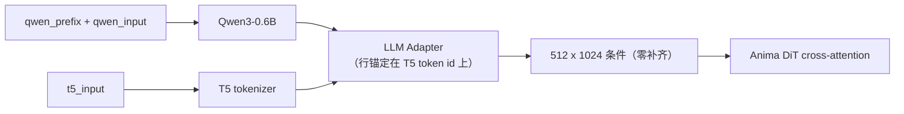

# ComfyUI Anima Decoupled Conditioning（Anima 解耦条件）

一个单节点 ComfyUI 扩展：让 Anima 真正使用的两个文本塔——**Qwen3-0.6B source 编码器**与
**T5 target 分词器**——分别接收**不同文本**。

[English](README.md) · [使用文档](docs/usage.md) · [机制说明](docs/mechanism.md)

---

## 它做什么

上游 Anima 把**同一段文本**分词两次，两份结果一起进同一条条件通路。本节点把这条绑定拆开：

| 输入 | 去向 | 作用 |
|---|---|---|
| `qwen_input` | Qwen3-0.6B source 编码器 | 对条件做上下文化 |
| `t5_input` | T5 target 侧 | **决定条件行数与每行的 token 锚** |
| `qwen_prefix` | 只拼到 Qwen 侧的 `qwen_input` 前 | 影响 source 隐状态 |
| `strip_prefix` | — | 默认开启：切掉前缀自身的行，使其不成为条件行 |

本节点只提供机制：不解析 XML、不清理标签、不校验格式，两侧内容由你决定。



## 安装

### 方式一 —— git（推荐）

```bash
cd ComfyUI/custom_nodes
git clone https://github.com/XiaoLinXiaoZhu/comfyui-anima-decoupled.git
```

然后重启 ComfyUI。

### 方式二 —— ComfyUI Manager

在 ComfyUI Manager 里选择 **Install via Git URL**，粘贴：

```
https://github.com/XiaoLinXiaoZhu/comfyui-anima-decoupled.git
```

除 ComfyUI 自带的 `torch` 外没有额外依赖。

## 快速开始

1. 添加 **Anima Decoupled Conditioning** 节点（分类 `conditioning`）。
2. 把 Anima checkpoint 的 `CLIP` 输出接到 `clip`。
3. 把节点的 `conditioning` 输出接到采样器的正向条件，位置与原来的 `CLIPTextEncode` 相同。
4. 填写 `qwen_input`、`t5_input`，必要时填 `qwen_prefix`。

常见的第一种配置——Qwen 收结构化描述，T5 收干净的 tag 串：

```
qwen_input = A girl stands on a rooftop at sunset, her coat open in the wind.
             Warm rim light, telephoto compression, shallow depth of field.
t5_input   = 1girl, solo, rooftop, sunset, coat, wind, rim light, telephoto
qwen_prefix = （留空）
strip_prefix = true
```

## 节点参数

| 输入 | 类型 | 必填 | 默认 | 说明 |
|---|---|---|---|---|
| `clip` | CLIP | 是 | — | Anima checkpoint 的 CLIP 输出（必须使用 Anima 的双分词器）。 |
| `qwen_input` | STRING（多行） | 是 | `""` | 交给 Qwen3-0.6B 的正文。 |
| `t5_input` | STRING（多行） | 是 | `""` | 交给 T5 分词的文本，决定条件行数与每行的 token 锚。 |
| `qwen_prefix` | STRING（多行） | 否 | `""` | 只拼到 Qwen 侧 `qwen_input` 前，中间恰好一个空格。 |
| `strip_prefix` | BOOLEAN | 否 | `true` | 是否从 source 隐状态里切掉前缀对应的行。 |

| 输出 | 类型 | 说明 |
|---|---|---|
| `conditioning` | CONDITIONING | extra 中带 `cross_attn`（source 隐状态）与 `t5xxl_ids` / `t5xxl_weights`；上游 `Anima.extra_conds` 负责跑 adapter 并零补齐到 512 行。 |

## 经典用例

### 1. source / target 解耦

Qwen 侧喂完整自然语言描述，T5 侧喂干净 tag 串（或反过来）。两侧完全独立：条件行数只由
`t5_input` 决定，Qwen 文本再长也不会撑大行数。

### 2. 提示词重复多遍 —— `PP【P】`

下文的记号：`P` 是你的提示词，`PP【P】` 表示「把 `P` 编码三遍，只保留第三遍作为条件行」：

```
qwen_prefix  = P P      <- 两遍，会被切掉
qwen_input   = P        <- 保留下来的那一遍
t5_input     = <你惯用的 tag 串>
strip_prefix = true
```

节点把它们拼成 `P P P` 一次编码，再按 token 级最长公共前缀切掉前两遍的行。保留下来的这一遍
通过 Qwen 的因果注意力看过前面两遍，因此带有近似双向的上下文；而条件行数与单遍完全一致。

为什么不直接把 `P P P` 塞进 `qwen_input`？因为那样三遍都会留在 adapter 可见的 key 里，
包括从没见过后文的第一遍。实测（单一 Anima checkpoint，条件向量层）：只保留最后一遍时条件的
位移是「三遍全可见」的 **2.8–3.8 倍**，且方向更纯——「三遍全可见」还混入了近乎正交的 key
复制效应。数字见[机制说明](docs/mechanism.md)。

重复超过三遍仍有收益但快速递减：第三遍已达到第六遍效果的约 86–92%，第二遍就拿到一半以上。

> 以上是条件向量层的测量，不是画面质量结论。它说明机制真实、并给出饱和位置；是否对你的图更好，
> 需要在你自己的提示词上做 A/B。

### 3. 不会变成「可绘制行」的前缀

`strip_prefix` 开启时，`qwen_prefix` 通过注意力影响后续每一行 source，但自身不贡献条件行。
这是放画师风格、画幅提示、固定套话的正确位置：直接写进 `t5_input` 的内容才是 DiT 读到的行，
而实测把元文本放在 target 侧时，它会被画成画面里的可见文字。

### 4. 控制行预算

有效条件行数 = `t5_input` 的 T5 分词长度（上游零补齐到 512 行）。把结构、注释、元数据放在
Qwen 侧，可以保持 `t5_input` 短小、真实行 : 零行比例高。

## `strip_prefix` 的工作方式

1. `source_text = qwen_prefix.strip() + " " + qwen_input.lstrip()`（前缀为空时原样返回正文）。
2. 用 Qwen 分词器分别对 `source_text` 与前缀分词。
3. 切掉的行数取两条 token id 序列的**实测**最长公共前缀长度，而不是
   `len(tokenize(prefix))`——拼接处存在空白合并，token 数可能差 1。
4. 在 adapter 之前按 `cond[:, dropped:]` 切掉这些行。

若前缀与拼接文本没有任何公共 token 前缀，节点直接报错，而不是悄悄保留前缀行。

## 兼容性

- 面向 Anima（Cosmos-Predict2 风格 DiT + Qwen3-0.6B source + T5 target）。
- 需要带 Anima 支持的上游 ComfyUI：`>= 0.11.0`（首个包含 `comfy/text_encoders/anima.py`
  的版本）。开发环境为 `0.37.0`。
- 节点类名保持 `AnimaDecoupledConditioning`，此前使用同名类保存的 workflow 仍可直接解析。

## 开发

```bash
python tests/test_anima_decoupled.py
```

测试使用替身 CLIP，无需模型与 GPU。

## 许可证

[MIT](LICENSE)
